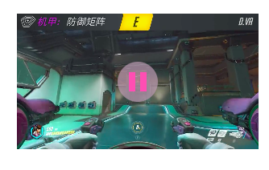

# video-player

，一款支持倍速播放，小窗播放，实时弹幕，弹幕聊天框，评论，放映环境等多种功能的视频播放器 Σ(⊙▽⊙"a ~

## 主要功能

-   控件区播放暂停
-   全屏播放暂停
-   播放时间和时长
-   评论
-   弹幕
-   进度条
-   倍速调节
-   音量调节
-   静音
-   小窗口模式
-   全屏模式
-   宽屏播放
-   剧场模式

## 界面展示

### 主界面

### 小窗口

